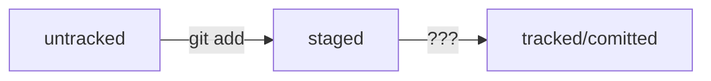

# Just try to create cheatlist

git init
git add
git commit
git push
git pull
git switch 
git branch

```mermaid
graph LR;
  untracked -- "git add" --> staged;
  staged    -- "???"     --> tracked/comitted;

``` 
